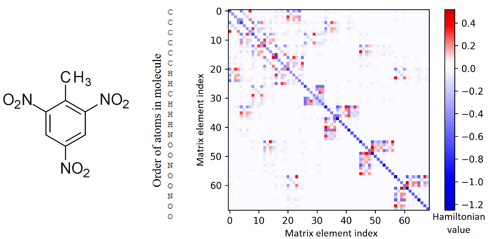

<p align="center">

</p>


# Extended Huckel method computational chemistry program

The goal of this project was to create an intuitive implementation of the [extended Hückel method](https://en.wikipedia.org/wiki/Extended_H%C3%BCckel_method) program in Python.
It is slow compared to other open-source or commercial alternatives and has many limitations, but it is an excellent material for learning or teaching.
This program undergoes [MIT license](https://github.com/D1s1ntegrator/extended-huckel/blob/main/LICENSE.md) which means it is open source and can be used or modified in any way you want.


## Features

- Uses molecular structure input files `.gjf` from the [GaussView 6](https://gaussian.com/gaussview6/)
- The user can select the charge of the molecule
- Supports atoms from hydrogen through neon
- STO-3G basis set from [Gaussian 16](https://gaussian.com/gaussian16/) program
- Ionisation energies from Edgar Muller and [Pyykkoe](https://pubs.acs.org/doi/10.1021/ic50221a002)
- Drop-in replacement for calculating integrals with [JAX](https://jax.readthedocs.io/) module, which supports GPU
- Energies calculation of orbitals and molecule
- Orbital occupation vizualization


## Usage

The program is run from the terminal with the following arguments:
```
python main.py input charge
```

Positional arguments:<br />
`input` - input file with molcular geometry<br />
`charge` - charge of the molecule (default: 0)<br />

## Code

Python 3.8 was used to create this program. External packages are listed as follows:

- [Numpy](http://www.numpy.org/)
- [Scipy](https://www.scipy.org/)
- [Matplotlib](https://matplotlib.org/)
- [Pandas](https://pandas.pydata.org/)
